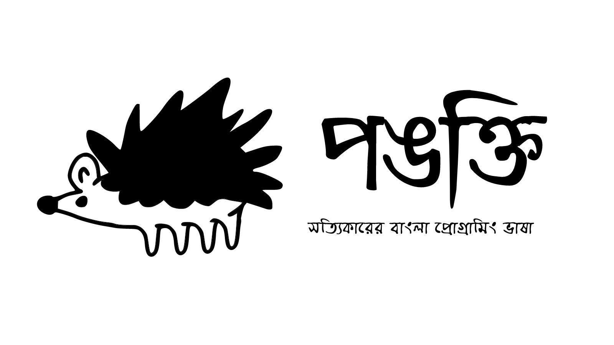

## Introduction

Pankti is an interpreted dynamically typed programming language for programming in the Bengali language. Vabna is designed with Bengali in mind but can also be used with English. As matter of fact, the implementation is so easy to modify that it can be used to program in any language with very little change to the source code of the vabna interpreter. Vabna is a potential multilingual programming language

## Why
My mother tongue is Bengali. Previously there have been few attempts to build a Bengali programming language but most of them have no practical usage, so I ventured into the dark world of language design.## Language Features

###  Data Types:
* Strings : `"পলাশ বাউরি"` , `"ভাবনা"`...
* Numbers:
    - Integers : `99999` , `1234567890` , `১২৩৪৫৬৭৮৯০`
    - Floats : `1.23` , `২০.০২`
* Dictionaries/Hashmap : `{ "নাম": "পলাশ", "বয়স" : 20  }`
* Arrays: `["রবিবার", "সোমবার" , 21 , 22 , ৯৯]`
* Booleans: `সত্য`, `মিথ্যা`

### Functions:
* Example: 
```go
ধরি ঘুমানো = একটি কাজ(নায়ক){
    দেখাও(নায়ক + " ঘুমোচ্ছে!");
}; 

ঘুমানো("পলাশ বাউরি")
```
```
Output: পলাশ বাউরি ঘুমোচ্ছে!
```
### Assignments:
* Examples:
```go
ধরি মাস = "বৈশাখ";
ধরি আজ_কি_ছুটি = মিথ্যা; 
```

## Project Status:
> **Alpha** (*Under Heavy Development*) 

## License:
> GNU GPL

## Special Thanks,
* Thorsten Ball for writing this amazing book "
Writing An Interpreter In Go
"
